[](https://classroom.github.com/a/YFgwt0yY)

# MiniTorch Module 2


- Docs: https://minitorch.github.io/

- Overview: https://minitorch.github.io/module2/module2/

This assignment requires the following files from the previous assignments. You can get these by running

```bash
python sync_previous_module.py previous-module-dir current-module-dir
```

The files that will be synced are:

        minitorch/operators.py minitorch/module.py minitorch/autodiff.py minitorch/scalar.py minitorch/scalar_functions.py minitorch/module.py project/run_manual.py project/run_scalar.py project/datasets.py

## Task 2.5 Training

### Simple Dataset

- `Layers`: 2
- `Learning Rate`: 0.1
- `Epochs`: 1000
- `Time per epoch`: 0.039s

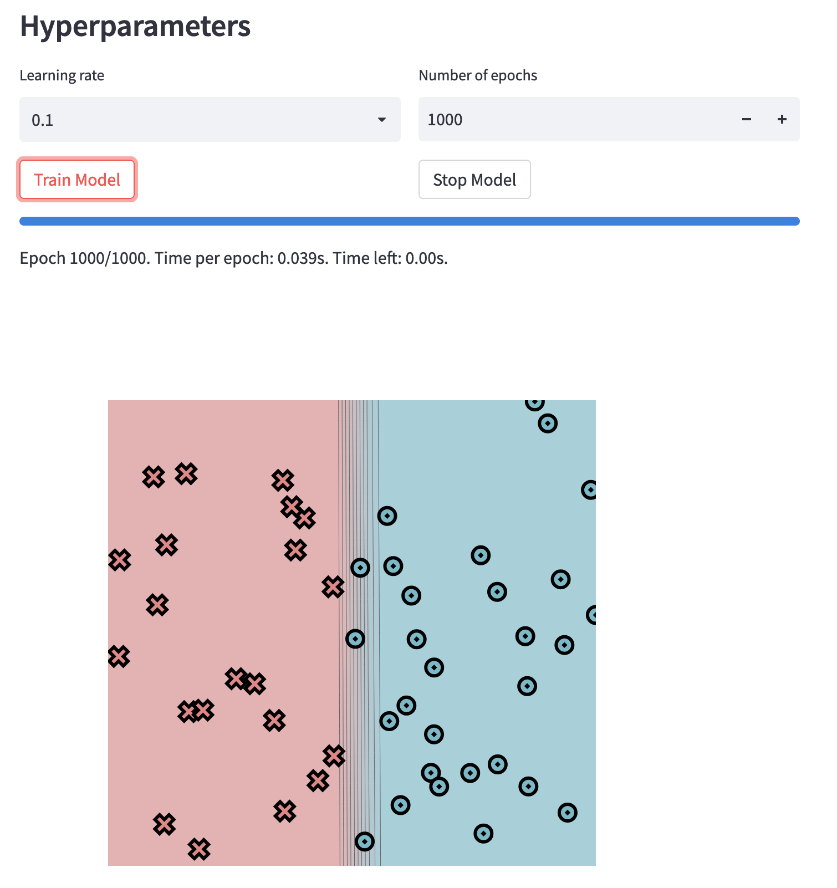
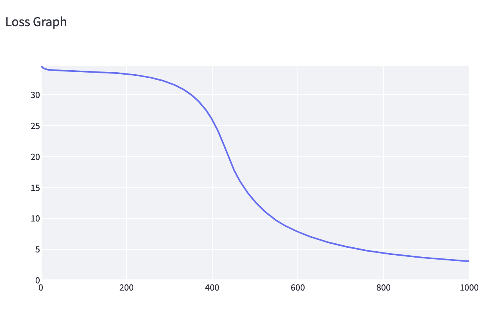

**Log:** [Simple Dataset Log](./logs/simple-2.csv)

### Diagonal Dataset

- `Layers`: 5
- `Learning Rate`: 0.1
- `Epochs`: 1000
- `Time per epoch`: 0.102s

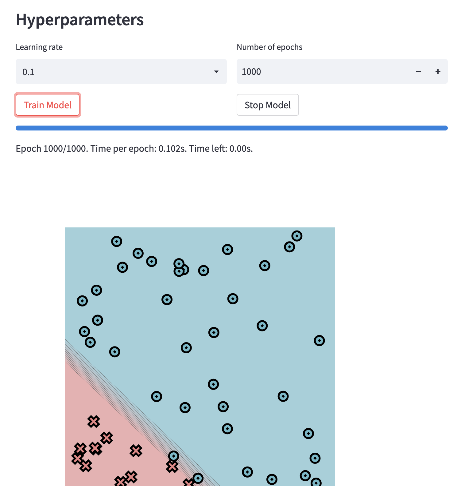
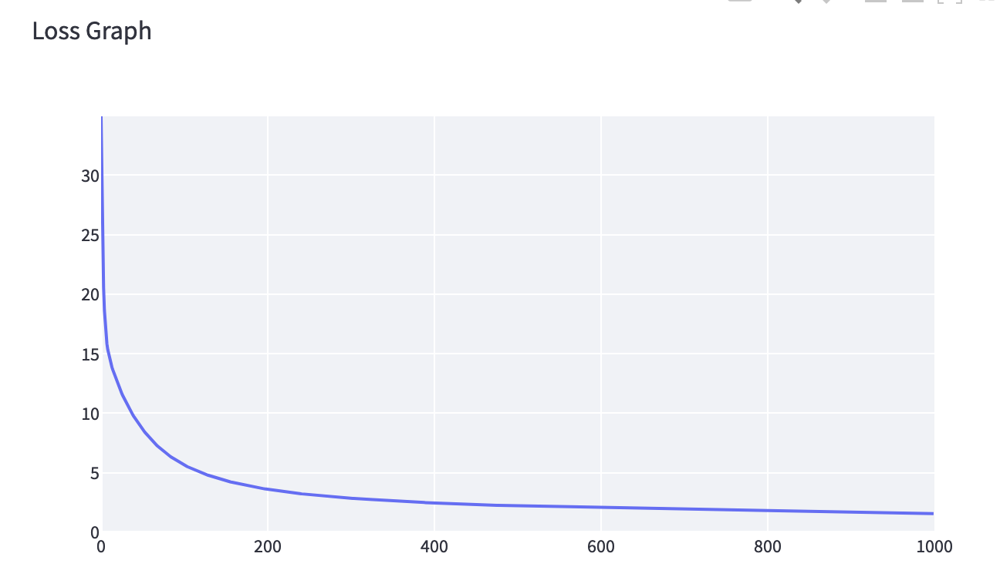

**Log:** [Diagonal Dataset Log](./logs/diag-5.csv)

### Split Dataset

- `Layers`: 5
- `Learning Rate`: 0.1
- `Epochs`: 1000
- `Time per epoch`: 0.102s

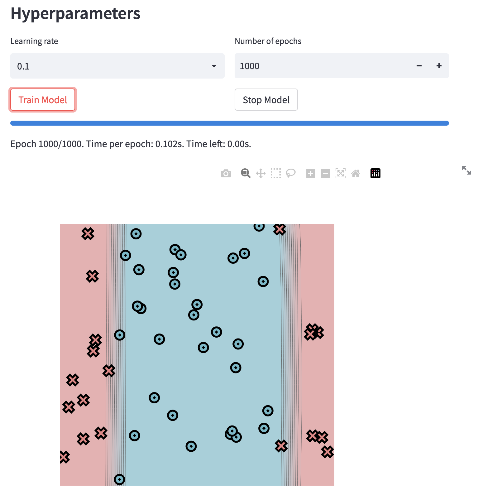
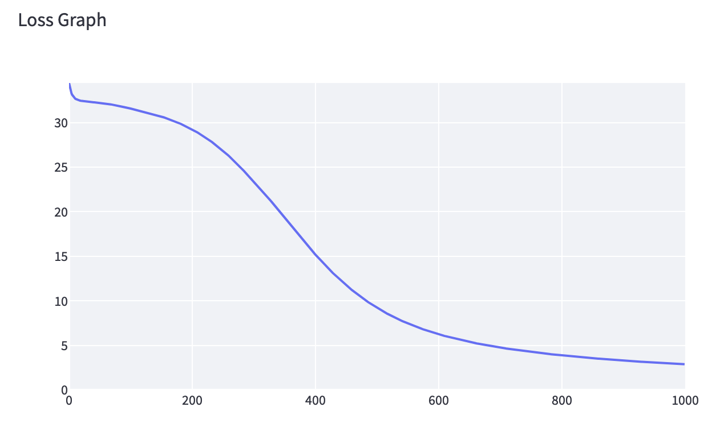

**Log:** [Split Dataset Log](./logs/split-5.csv)

### Circle Dataset

- `Layers`: 5
- `Learning Rate`: 0.1
- `Epochs`: 1000
- `Time per epoch`: 0.102s

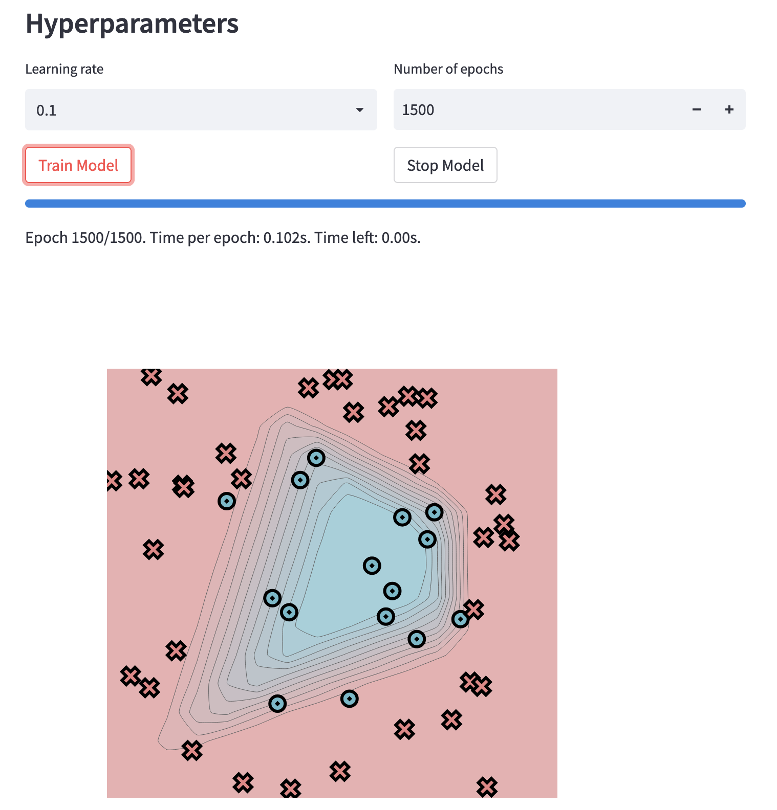
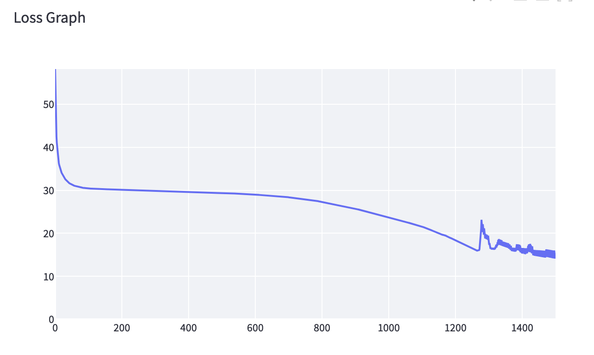

**Log:** [Circle Dataset Log](./logs/circle-5.csv)

### Xor Dataset

- `Layers`: 5
- `Learning Rate`: 0.1
- `Epochs`: 1000
- `Time per epoch`: 0.103s

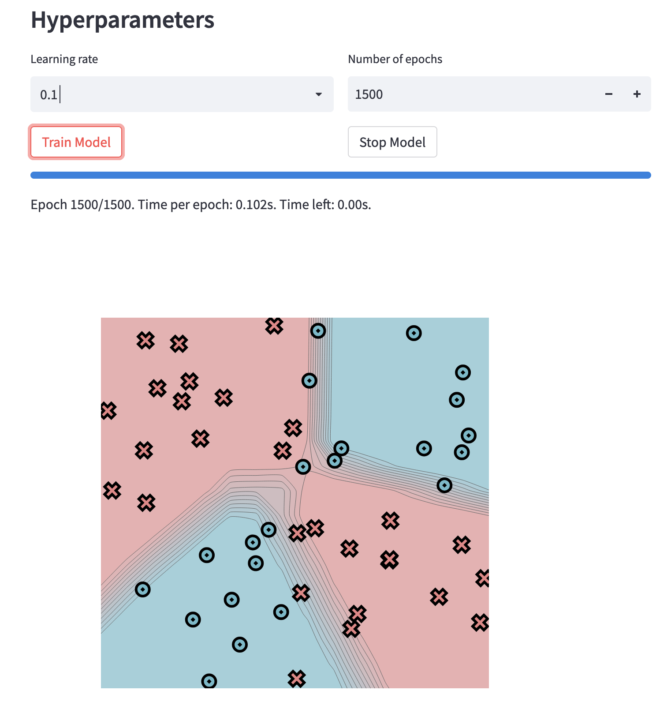
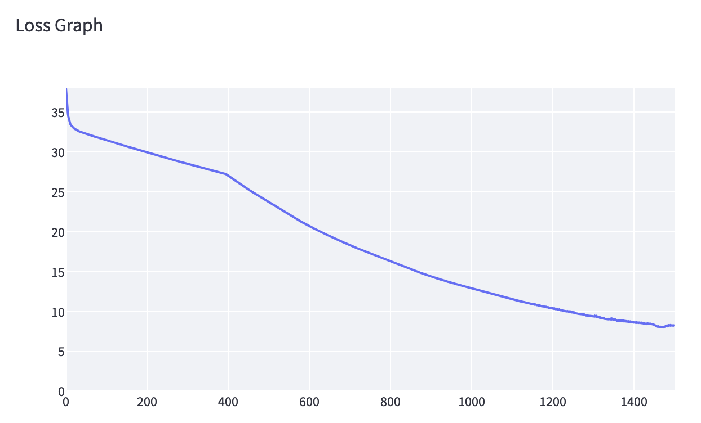

**Log:** [Xor Dataset Log](./logs/xor-5.csv)

### Spiral Dataset

- `Layers`: 10
- `Learning Rate`: 0.01
- `Epochs`: 1000
- `Time per epoch`: 0.280s

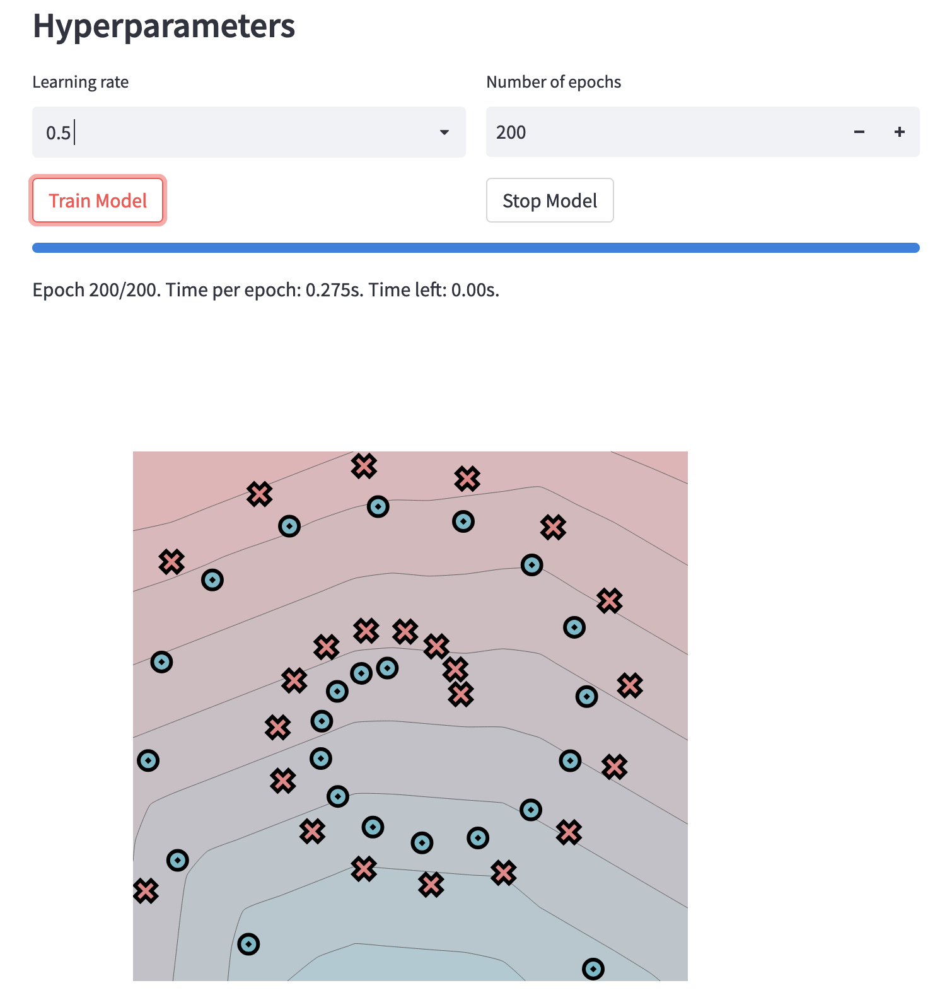
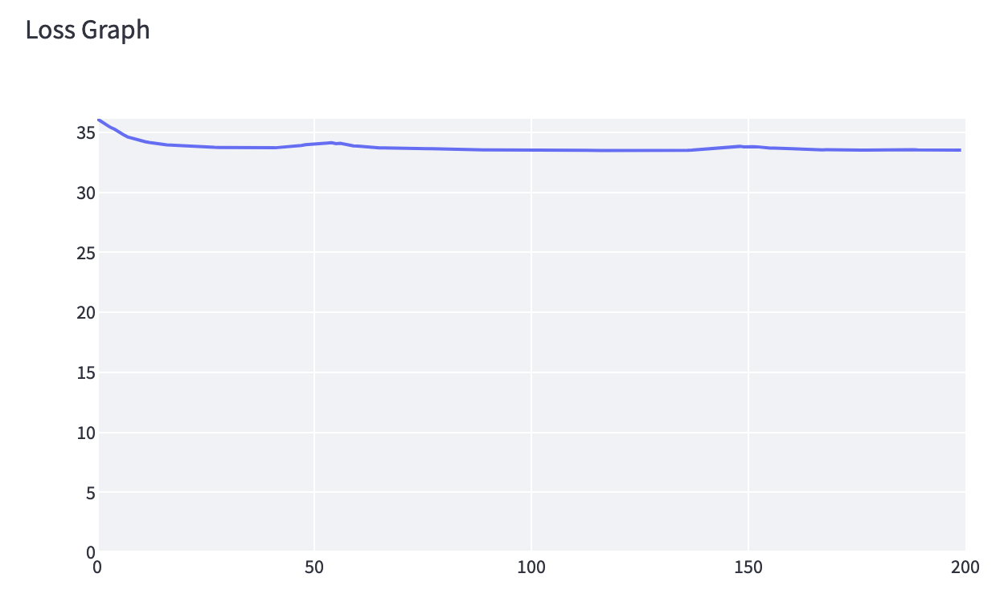

**Log:** [Spiral Dataset Log](./logs/spiral-10.csv)
